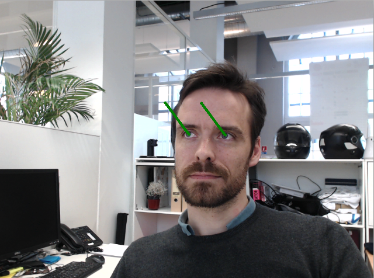

Python client app
=================

We can now extend this code to have Angus process this stream.

Note that we use the method ``enable_session()`` and ``disable_session()`` to let the service know that the successive images received are from the same stream. This allows overall better performances as previous calls are used to refine the results.

.. literalinclude:: sceneanalysis_fromwebcam.py

You should see two green vectors showing what your are looking displayed on your screen:

