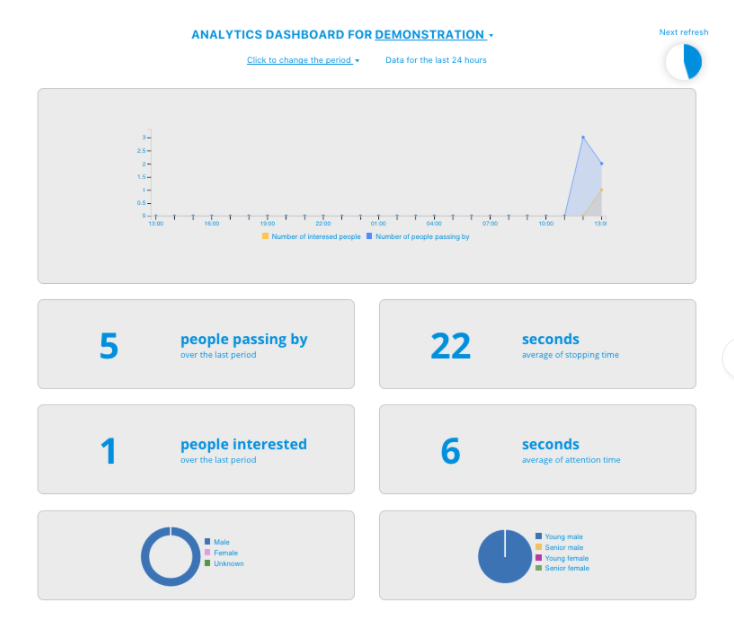

.. _dashboard:

Online dashboard
================

How to view your dashboard
--------------------------

The collected data are meant to be collected programmatically through Angus.ai Data API (see appropriate documentation). But for demonstration purposes, we have put together a standard dashboard that allow for a simple visualisation over your collected data.

We will use this default dashboard to check that your installation is properly set and that your data are properly stored.

1. Go back to your personal account here: https://console.angus.ai/
2. Click on the “Show Dashboard” button on the stream you created above.
3. You should see a page showing an empty dashboard. After waiting for the next automatic     refresh (see the watch icon on the top right hand corner), your first collected data should appear (as shown on the screenshot below).
4. If your don’t see data appear, please try to get out of the camera field of view and re-enter again.

What are these metrics?
-----------------------

**People passing by**
Count of people who passed (not necessarily stopping or looking) in front of the camera for at least 1 second.

**People Interested**

Count of people who stopped for at least 3 seconds and looked in the direction of the camera more than 1 second, during the specified time duration.

**Average stopping time**

Average time a person, among the “interested” people (see above), stay still in front of the camera (in second).

**Average attention time**
Average time a person, among the “interested” people (see above), spend looking at the camera (in second).

**Age Pie Chart**
Population segmentation counts of all the “interested” people (see above) for each category.

**Gender Chart**
The gender repartition of all the “interested” people (see above).
