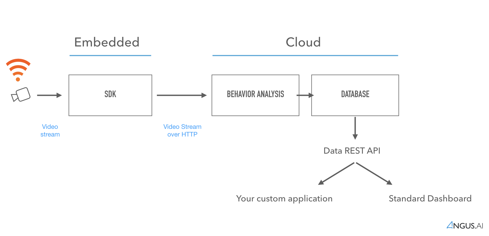

Tutorial
========

This documentation is meant at developers wanting to install, configure and launch Angus.ai audience analytics application on a PC. Once properly installed and configured, this application will interact with Angus.ai cloud based algorithms to provide audience metrics that can be retrieve through a REST API (see the appropriate documentation to retrieve this data).

1. Create an account (:ref:`create-account`)
2. Create access credentials for your first camera (:ref:`create-stream`)
3. Download and configure our SDK (open source) (:ref:`sdk`)
4. Download and launch our application (open source) (:ref:`apps`)
5. Check that metrics are correctly collected server side (:ref:`dashboard`)
6. Retrieve programmatically your metrics (:ref:`data-api`)
