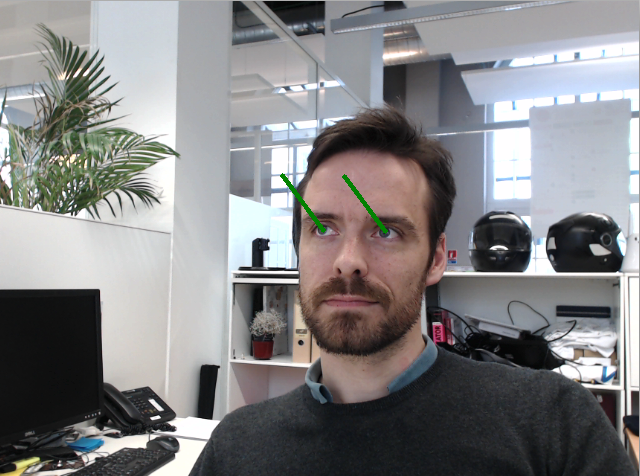

.. _apps:

Client app
++++++++++
.. after-title

Our client app is a lightweight, open source Python script. It works either with **Python 2** or **Python 3**

It performs two basic tasks:

1. retrieve a valid video stream. By default, one of the connected USB camera will be chosen, but you can easily modify the client app to open a different camera and even open a video file.

2. package and send the video stream over https to our computation servers. This part can also be optimized for your needs (image resolution, frame rate, etc...).

If you need help to perform these optimizations, please contact us at support@angus.ai.

**Prerequisite**

- you have a working webcam plugged into your PC
- you have installed **OpenCV3** python bindings and **pytz**. To do this, just run :

.. parsed-literal::

   $ pip install opencv-python pytz

Note also that OpenCV3 is not an absolute pre-requisite, the following code sample can easily be adapted to be used with any other way of retrieving successive frames from a video stream.

**Client App**

Please copy/paste the following code sample in a file and run it.

.. literalinclude:: sceneanalysis_fromwebcam.py

To run it:

.. parsed-literal::

  $ python yourcopiedfile.py

You should see two green vectors showing what your are looking displayed on your screen:

The application displays by default a live view of your stream, with gaze vectors super-imposed. If you need it, it is also possible to display age, gender, emotion, etc... Please refers to the app real-time API here : (:ref:`scene-analysis-api`).
