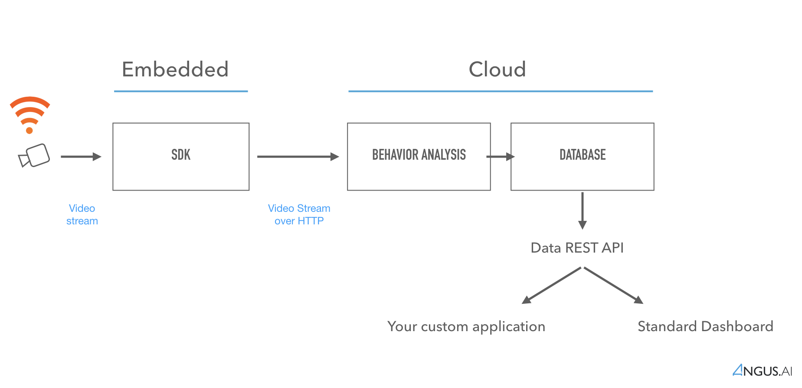

Tutorial
========

This documentation is meant at developers wanting to install, configure and use Angus.ai services on a PC.

1. Create an account (:ref:`create-account`)
2. Create access credentials for your first camera (:ref:`create-stream`)
3. Download and configure our SDK (open source) (:ref:`sdk`)
4. Pick the building block that you wish to use and follow the instructions (:ref:`services-doc`)
