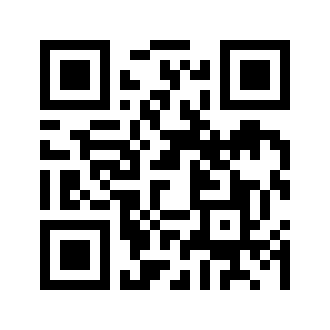

Qrcode decoder
==============

Do I see a qrcode ? What is the content ?

Getting Started
---------------

You can use this qrcode for example:

Using Angus python SDK:

.. literalinclude:: qrcode.py

Input
-----

The API takes a stream of 2d still images as input, of format ``jpg`` or ``png``, without constraints on resolution.

Note however that the bigger the resolution, the longer the API will take to process and give a result.

The function ``process()`` takes a dictionary as input formatted as follows:

.. code-block:: javascript

    {'image' : file}

* ``image``: a python ``File Object`` as returned for example by ``open()`` or a ``StringIO`` buffer.

Output
------

Events will be pushed to your client following that format:

.. code-block:: javascript

    {
      "type": "QRCODE",
      "data": "http://www.angus.ai"
    }

* ``type`` : qrcode data type
* ``data`` : content

Code Sample
-----------

**requirements**: opencv2, opencv2 python bindings

This code sample retrieves the stream of a webcam and print on
standard output the qrcode content data.

.. literalinclude:: qrcode_fromwebcam.py
