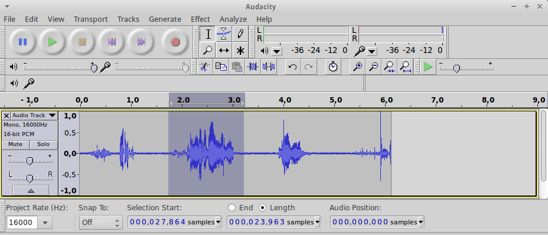

Word Spotting (version 1)
=========================

These services spots specified words (or group of words) in a complex speech input.

**Warning** : this service is available in all languages but will tend to work only with speakers the service will have been trained for.
If you prefer a service that does not require to be trained, look at :ref:`wordspotting_v2`.

To train the service, just record and provide a few voice samples for each words (or group of words) that you want to be spotted (as described below).

How to prepare samples?
-----------------------

The more sample of word or sentence you provide, the better the service will perform.

To prepare these samples, you can use an audio recording application (like Audacity).

These samples need to be provided to the service with the following format ``mono, 16kHz, 16bit PCM``.
In Audacity, go to Edit > Preferences... > Quality, and set the Sampling settings to ``16000Hz`` and ``16-bit``.

Press ``record`` and pronounce several time each word you want to have recognized. If you want to have multiple people using the service, have the word pronounced by several people.

Then extract each sample from the signal by using the appropriate selection + export procedure. In Audacity, use the ``File > Export Selected Audio...`` for each sample you want to extract.

Getting Started
---------------

Using the Angus python SDK:

.. literalinclude:: wordspotting.py

Input
-----

.. code-block:: javascript

   {'sound' : file,
    'vocabulary' : {"word1": [sample_1, sample_2], "word2" : [sample_1, sample_2]},
    'sensitivity' : 0.3}

* ``sound`` : a python ``File Object`` as returned for example by ``open()`` or a ``StringIO`` buffer describing a wav file with the following format : ``PCM 16bit, Mono``, without constraints on sample rate.
* ``vocabulary`` : a dictionary containing samples of the words that need to be spotted. Samples need to be provided to the service first with the function ``blobs.create()`` as shown in the example above. The more samples the better, but starting with only 1 sample per word is OK.
* ``sensitivity`` : modifies the ability of the algorithms to detect quiet sounds. ``[0, 1]``. The higher the value is, the better the algorithm will detect quiet sounds, but the more it will be sensitive to background noise.

Output
------

Events will be pushed to your client following that format:

.. code-block:: javascript

    {
      "utterance_length" : 1230,
      "nbests" : [
                  {
                    "key" : "turn wifi on",
                    "confidence" : 0.75
                  },
                  {
                    "key" : "turn wifi off",
                    "confidence"   : 0.10
                  }
                ]
    }

* ``utterance_length`` : length of the utterance on which the provided result has been computed (in ``ms``).
* ``key`` : the key identifying a given group of samples (as specified in the ``vocabulary`` input).
* ``confidence`` : an estimate of the probability that the corresponding vocabulary words were spotted in the utterance.

Code Sample
-----------

**requirements**: PyAudio & Sox

This code sample retrieve the audio stream of a web cam / mic and display the result of the ``word_spotting`` service.

.. literalinclude:: wordspotting_streaming.py
