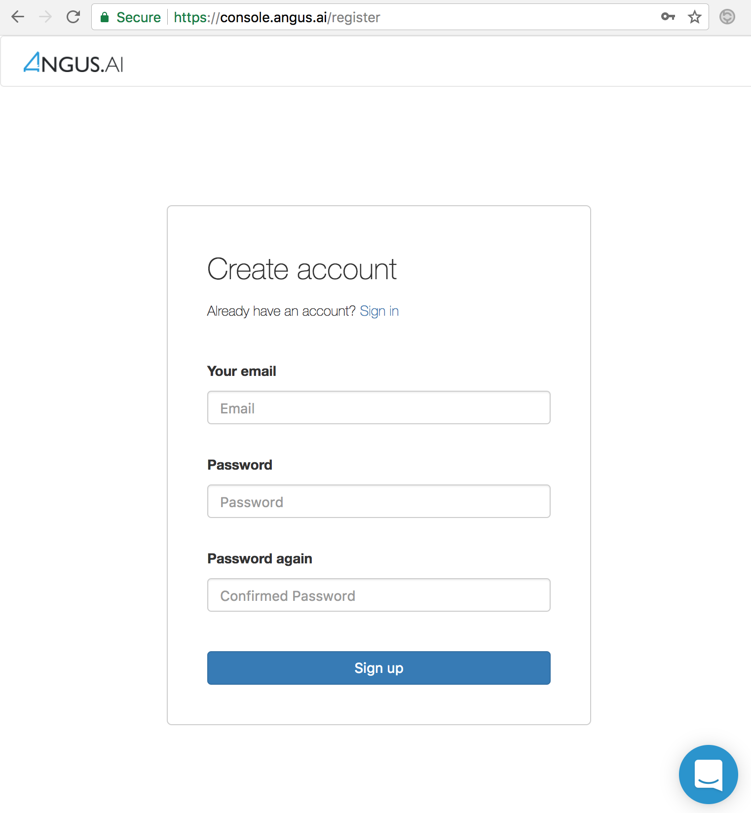

.. _create-account:

Create an account
=================

To use Angus.ai services, you need to create an account. This can be done very easily by visiting `<https://console.angus.ai>`_ and filling the form shown below.

When done, you are ready to create you first camera stream (:ref:`create-stream`).
