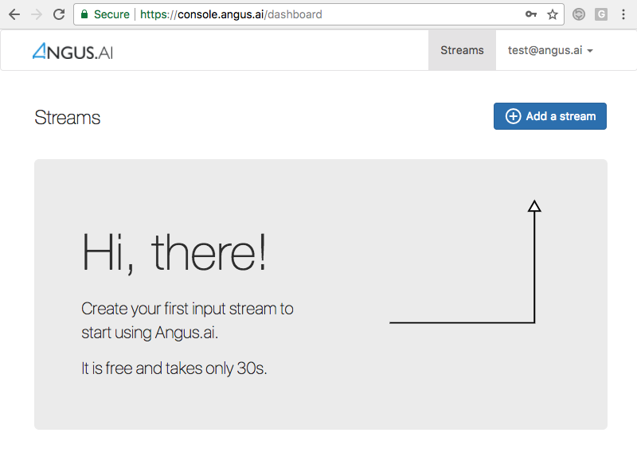
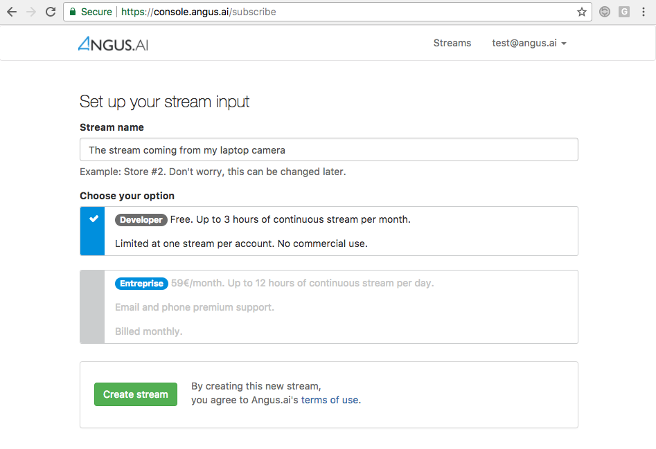
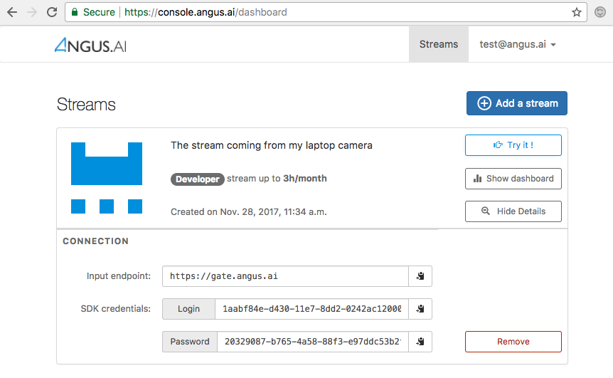

.. _create-stream:

Create new credentials
++++++++++++++++++++++
.. after-title

After creating your personal account on https://console.angus.ai/, you will be asked to create a “stream”. This procedure will allow for a private “access_token” and “client_id” keys to be generated for you. This can be done by pressing the “Add a stream” button on the top right hand corner as shown below.

After clicking, you will be asked to choose between a free developer stream and a paying enterprise stream. Please note that the free developer stream is only for non commercial use and will block after 3 hours of video stream computed every month as seen below.

For an non restricted enterprise stream, you will need to enter a valid credit card number.

Press “Continue” at the bottom of the page and you will soon get the following page. Press “Show Details” and take note of your “client_id” and “access_token” keys as they will be needed later on.

The credentials that you have just created will be used to configure the Angus.ai SDK. Your are now ready to proceed to the next step.
