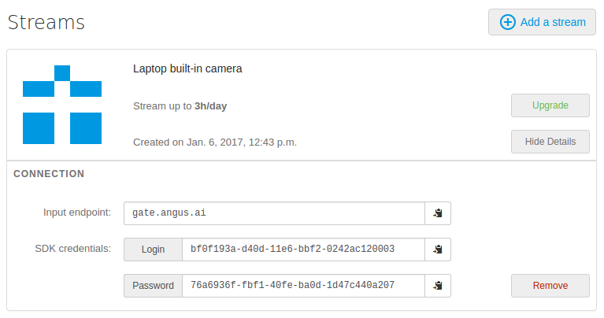

Getting Started with Java
+++++++++++++++++++++++++

*Prerequisites*

You must have registered `here <https://console.angus.ai/register>`_ to generate your API credentials.
Angus Java SDK need Java7 runtime.

1. Download Angus SDK library
=============================

You can download the library from github: `here <https://github.com/angus-ai/angus-sdk-java/releases/download/0.0.2/angus-sdk-java-0.0.2-jar-with-dependencies.jar>`_.

2. Configure your SDK
=====================

You must configure your sdk with the keys you received by creating a stream here `here <https://console.angus.ai/>`_.
These keys are used to authenticate the requests you are about to send.

Your API credentials can be retrieved by clicking on "Show details" on your console interface as shown below:

In a terminal, type:

.. parsed-literal::

    $ java -jar angus-sdk-java-0.0.2-jar-with-dependencies.jar
    Please copy/paste your client_id: ********-****-****-****-************
    Please copy/paste your access_token: ********-****-****-****-************
    $

Fill in the "client_id" prompt with the "login" given on the interface and
the "access_token" prompt with the "password" given on the interface.

You could explore all options by typing:

.. parsed-literal::

    $ java -jar target/angus-sdk-java-0.0.2-jar-with-dependencies.jar --help

3. Send your first request
==========================

Your are now ready to use the sdk to send your first request.

Pick a ``jpg`` or ``png`` image file showing at least one human face and open 
your prefered Java IDE (or a simple text editor). Copy/paste this code snipet by
replacing the image path into a file named "FaceDetect.java":

.. code-block:: java

    import java.io.IOException;
    import org.json.simple.JSONObject;
    import ai.angus.sdk.Configuration;
    import ai.angus.sdk.Job;
    import ai.angus.sdk.ProcessException;
    import ai.angus.sdk.Root;
    import ai.angus.sdk.Service;
    import ai.angus.sdk.impl.ConfigurationImpl;
    import ai.angus.sdk.impl.File;

    public class FaceDetect {

      public static void main(String[] args) throws IOException, ProcessException {
        Configuration conf = new ConfigurationImpl();

        Root root = conf.connect();
        Service service = root.getServices().getService("age_and_gender_estimation", 1);

        JSONObject params = new JSONObject();
        params.put("image", new File("path/to/your/image.png"));

        Job job = service.process(params);

        System.out.println(job.getResult().toJSONString());
     }
    }

Then run java compiler (``javac``) to get a ``.class`` file:

.. parsed-literal::
    $  javac -cp ./angus-sdk-java-0.0.2-jar-with-dependencies.jar FaceDetect.java

Then, you can run this program by typing:

.. parsed-literal::
    $ java -cp 'angus-sdk-java-0.0.2-jar-with-dependencies.jar:.' FaceDetect

This should display a result looking like this:

.. parsed-literal::

        {u'url': u'https://gate.angus.ai/services/age_and_gender_estimation/1/jobs/8e260a0e-14ec-11e5-9d37-fd0e94abcba1', u'status': 201, u'input_size': [576, 768], u'faces': [{u'roi': [249, 141, 234, 234], u'gender': u'male', u'age_confidence': 0.5, u'gender_confidence': 0.8280000686645508, u'roi_confidence': 0.7880000472068787, u'age': 50.0}], u'nb_faces': 1}

This json dictionnary contains a set of ``key: value`` describing what has been seen in that image by the service you just called. This result can then be easily parsed by your application.

The ``keys`` contained in result dictionaries depend on the service used and are documented in the services documentation, see :ref:`services-doc`.

You have just sent your first request to Angus.ai, Congratulations! 

3. Access your sensor stream
============================

Some applications will require a processing on all the data coming from a sensor (e.g. a web cam).

*Prerequisite*

- you have a working web cam plugged into your PC

We will use `webcam-capture <https://github.com/sarxos/webcam-capture>`_ to get the camera images.

Get the zip files with dependencies `here <https://github.com/sarxos/webcam-capture/releases/download/webcam-capture-parent-0.3.10/webcam-capture-0.3.10-dist.zip>`_ and unzip it.

Copy this code snippet in a file named `DisplayCamera.java`.

.. literalinclude:: DisplayCamera.java
   :language: java

Compile it:

.. parsed-literal::

  $ javac -cp "angus-sdk-java-0.0.2-jar-with-dependencies.jar:webcam-capture-0.3.10.jar:." DisplayCamera.java

Check that your web cam video stream is correctly displayed on your screen:

.. parsed-literal::
  $ java -cp "angus-sdk-java-0.0.2-jar-with-dependencies.jar:webcam-capture-0.3.10.jar:libs/*:." DisplayCamera

.. image:: gwenn_onwebcam.png

4. Send this stream to Angus
============================

We can now extend this code to have Angus process this stream.
Like above, we will use the service ``age_and_gender_estimation`` but all the services taking images as inputs can be used.

Note that we use the method ``enable_session()`` and ``disable_session()`` to let the service know that the successive images received are from the same stream. This allows overall better performances as previous calls are used to refine the results. 

Using this functions might delayed a bit the appearance and disappearance of detected targets. If this is an issue for your application, just remove these calls from your script. The service will process the successive images independently.

.. literalinclude:: StreamAgeAndGender.java
   :emphasize-lines: 27-29,44,49-53
   :language: java

You should see your age/gender estimation write on standard output.

5. Congratulations!
===================

You have designed your first app using Angus.ai : an age and gender estimator. Congratulations!

