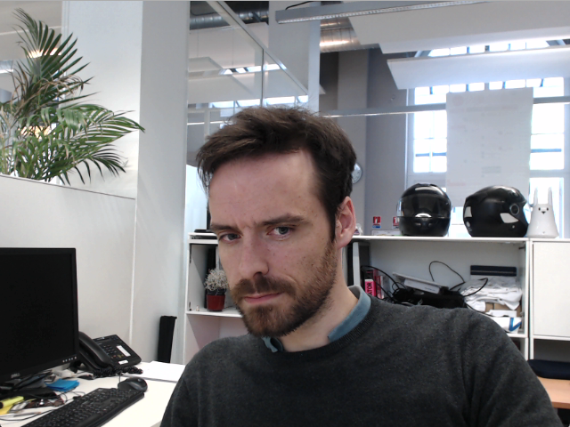

Getting Started with Python
+++++++++++++++++++++++++++

You must have registered `here <http://www.angus.ai/request-credentials/>`_ and received your API credentials.

The SDK is Python3 compatible but the documentation code snippets are Python2.

You might want to create a python virtual environnement with **virtualenv** in order to install sdk in there. Please refere to the following `python guide <http://docs.python-guide.org/en/latest/dev/virtualenvs/>`_ for more information.

1. Install the Angus SDK
========================

Open a terminal and install the angus python sdk with pip. If you do not use **virtualenv** you may need to be root, administrator or super user depending on your platform (use sudo on linux platform).

.. parsed-literal::

        $ pip install angus-sdk-python

2. Configure your SDK
=====================

You must configure your sdk with the keys you received by registering `here <http://www.angus.ai/request-credentials/>`_.
These keys are used to authenticate the requests you are about to send.

In a terminal, type:

.. parsed-literal::

   $ angusme
   Please choose your gateway (current: https://gate.angus.ai): 
   Please copy/paste your client_id: xxxxxxxx-xxxx-xxxx-xxxx-xxxxxxxxxxxx
   Please copy/paste your access_token: xxxxxxxx-xxxx-xxxx-xxxx-xxxxxxxxxxxx

On **Windows** system, if angusme does not work, please refer to the :ref:`faq` for more details.

3. Send your first request
==========================

Your are now ready to use the sdk to send your first request.

Pick a ``jpg`` or ``png`` image file showing at least one human face and open a python console (by typing the command ``python`` in a terminal).

.. code-block:: python

        > import angus
	> from pprint import pprint
        > conn = angus.connect()
        > service = conn.services.get_service('age_and_gender_estimation', version=1)
        > job = service.process({'image': open("path/to/your/image.png")})
        > pprint(job.result)

This should display a result looking like this:

.. parsed-literal::

        {u'url': u'https://gate.angus.ai/services/age_and_gender_estimation/1/jobs/8e260a0e-14ec-11e5-9d37-fd0e94abcba1', u'status': 201, u'input_size': [576, 768], u'faces': [{u'roi': [249, 141, 234, 234], u'gender': u'male', u'age_confidence': 0.5, u'gender_confidence': 0.8280000686645508, u'roi_confidence': 0.7880000472068787, u'age': 50.0}], u'nb_faces': 1}

This python dictionnary contains a set of ``key: value`` describing what has been seen in that image by the service you just called. This result can then be easily parsed by your application.

The ``keys`` contained in result dictionaries depend on the service used and are documented in the services documentation, see :ref:`services-doc`.

You have just sent your first request to Angus.ai, Congratulations!

4. Access your sensor stream
============================

Some applications will require a processing on all the data coming from a sensor (e.g. a webcam).

*Prerequisite*

- you have a working webcam plugged into your PC
- you have installed **OpenCV2** and **OpenCV2** python bindings. Please refer to `OpenCV documentation <http://opencv.org/>`_ to proceed, or check :ref:`faq` chapter.
  
On Debian-like platform, **OpenCV2** comes pre-installed, you just need to run

.. parsed-literal::

   $ sudo apt-get install python-opencv

Then, copy this code snippet in a file and run it.

.. literalinclude:: stream_fromwebcam.py

.. parsed-literal::

  $ python yourcopiedfile.py

Check that your web cam video stream is correctly displayed on your screen.

5. Send this stream to Angus
============================

We can now extend this code to have Angus process this stream.
Like above, we will use the service ``age_and_gender_estimation`` but all the services taking images as inputs can be used.

Note that we use the method ``enable_session()`` and ``disable_session()`` to let the service know that the successive images received are from the same stream. This allows overall better performances as previous calls are used to refine the results.

Using this functions might delayed a bit the appearance and disappearance of detected targets. If this is an issue for your application, just remove these calls from your script. The service will process the successive images independently.

.. literalinclude:: agegenderestimation_fromwebcam.py
   :emphasize-lines: 21-23,31-36,52

You should see your age/gender estimation displayed on your screen:

.. image:: gwenn_onwebcam_agegender.png

6. Congratulations!
===================

You have designed your first app using Angus.ai : an age and gender estimator. Congratulations!
