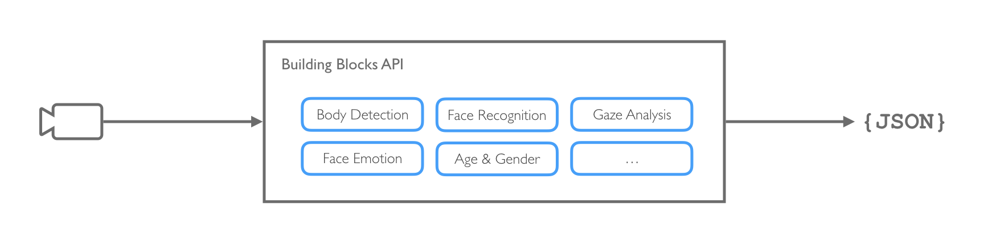

Tutorial
========

Step 1 - Introduction
*********************

This documentation is meant at developers wanting to use Angus.ai building blocks API services.

What the difference with other AI building blocks providers?
------------------------------------------------------------

Angus.ai is focus 100% on turning existing 2D cameras into a new generation of monitoring and alerting tools,
as a consequence these building blocks are optimized to work:

- on video streams
- in realtime
- and with low resolution 2D cameras

How it works
------------

Angus.ai audience analytics solution is based on a (lightweight) Client / Server architecture as seen on the figure below.
All CPU expensive computation are made on our dedicated servers making it possible to run the solution from about any CPU board that can retrieve a camera stream and connect to a server (eg. Raspberry).

.. image:: archi-building-blocks.png

List of the available building blocks
-------------------------------------

.. toctree::
   :maxdepth: 2

   services/index

Requirements
------------

As you go through this tutorial, you will need:

- a computer. Every operating system is ok provided that you can configure a Python or Java stack.
- a camera (e.g. webcam) plugged into that computer. USB and IP cameras are supported, although IP cam can be more challenging to interface. If you need help doing so please contact us at support@angus.ai.
- a working internet connection.

Step 2 - Install our SDK
************************

Create an account
-----------------

.. include:: ../../console/create-account.rst
  :start-after: after-title

Get credentials for your camera
-------------------------------

.. include:: ../../console/create-stream.rst
  :start-after: after-title

Download and configure the SDK
------------------------------

.. include:: ../../restful/sdk/python.rst
  :start-after: after-title
  :end-before: stop-here

Step 3 - Pick your building block
*********************************

.. toctree::
   :maxdepth: 2

   services/index

What next?
----------

Congratulations! You went through all the steps to use our building blocks.

- When time comes, you can plug more cameras by creating additional stream as shown here (:ref:`create-stream`).
- If you need to deploy your system in a situation where internet bandwidth is a problem, please contact us at support@angus.ai.

For any issues please contact Angus.ai team at: support@angus.ai, and if possible,
please specify your operating system, python or java version, as well as the error backtrace if any. Thanks!
