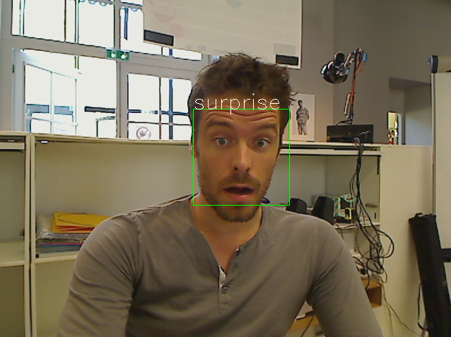

Face Expression Estimation
==========================

Are people in front looking happy or surprised?

Getting Started
---------------

Using Angus Python SDK:

.. literalinclude:: faceexpressionestimation.py

Input
-----

The API takes a stream of 2d still images as input, of format ``jpg`` or ``png``, without constraints on resolution.

Note however that the bigger the resolution, the longer the API will take to process and give a result.

The function ``process()`` takes a dictionary as input formatted as follows:

.. code-block:: javascript

    {'image' : file}

* ``image``: a python ``File Object`` as returned for example by ``open()`` or a ``StringIO`` buffer.

Output
------

Events will be pushed to your client following that format:

.. code-block:: javascript

    {
      "input_size" : [480, 640],
      "nb_faces" : 1,
      "faces" : [
                  {
                    "roi" : [345, 223, 34, 54],
                    "roi_confidence" : 0.89,
                    "neutral" : 0.1,
                    "happiness" : 0.2,
                    "surprise" : 0.7,
                    "anger" : 0.01,
                    "sadness" : 0.1,
                  }
                ]
    }

* ``input_size`` : width and height of the input image in pixels (to be used as reference to ``roi`` output.
* ``nb_faces`` : number of faces detected in the given image
* ``roi`` : contains ``[pt.x, pt.y, width, height]`` where pt is the upper left point of the rectangle outlining the detected face.
* ``roi_confidence`` : an estimate of the probability that a real face is indeed located at the given ``roi``.
* ``neutral``, ``happiness``, ``surprise``, ``anger``, ``sadness`` : a float in ``[0, 1]`` measuring the intensity of the corresponding face expression.

Code Sample
-----------

**requirements**: opencv2, opencv2 python bindings

This code sample retrieves the stream of a web cam and display in a GUI the result of the ``face_expression_estimation`` service.

.. literalinclude:: faceexpression_fromwebcam.py

