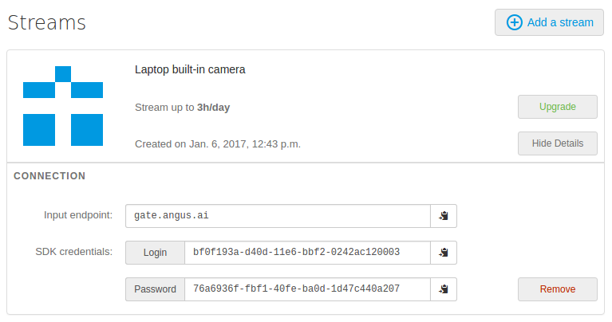

Java SDK
++++++++

*Prerequisites*

You must have registered `here <https://console.angus.ai/register>`__ to generate your API credentials.
Angus Java SDK need Java7 runtime.

1. Download the SDK library
===========================

You can download the library from github: `here <https://github.com/angus-ai/angus-sdk-java/releases/download/0.0.2/angus-sdk-java-0.0.2-jar-with-dependencies.jar>`__.

2. Configure your SDK
=====================

You must configure your sdk with the keys you received by creating a stream here `here <https://console.angus.ai/>`__.
These keys are used to authenticate the requests you are about to send.

Your API credentials can be retrieved by clicking on "Show details" on your console interface as shown below:

In a terminal, type:

.. parsed-literal::

    $ java -jar angus-sdk-java-0.0.2-jar-with-dependencies.jar
    Please copy/paste your client_id: xxxxxxxx-xxxx-xxxx-xxxx-xxxxxxxxxxxx
    Please copy/paste your access_token: xxxxxxxx-xxxx-xxxx-xxxx-xxxxxxxxxxxx

Fill in the "client_id" prompt with the "login" given on the interface and
the "access_token" prompt with the "password" given on the interface.

You could explore all options by typing:

.. parsed-literal::

    $ java -jar angus-sdk-java-0.0.2-jar-with-dependencies.jar --help

3. Access your sensor stream
============================

Angus.ai API is specifically designed to process a video stream. This section will show you a way to access the stream of a webcam plugged to your computer by using `webcam-capture <https://github.com/sarxos/webcam-capture>`_.

Note that the following code sample can be adapted to process a video file instead.

Note also that `webcam-capture <https://github.com/sarxos/webcam-capture>`_ is not an absolute pre-requisite, the following code sample can easily be adapted to be used with any other way of retrieving successive frames from a video stream. If you need assistance, please contact us at contact@angus.ai

*Prerequisite*

- you have a working web cam plugged into your PC

We use here `webcam-capture <https://github.com/sarxos/webcam-capture>`_ to get the camera images.

Get the zip files with dependencies `here <https://github.com/sarxos/webcam-capture/releases/download/webcam-capture-parent-0.3.10/webcam-capture-0.3.10-dist.zip>`__ and unzip it.

Copy this code snippet in a file named `DisplayCamera.java`.

.. literalinclude:: DisplayCamera.java
   :language: java

Compile it (change path to webcam-capture dependency accordingly):

.. parsed-literal::

  $ javac -cp "angus-sdk-java-0.0.2-jar-with-dependencies.jar:webcam-capture-0.3.10.jar:." DisplayCamera.java

Check that your web cam video stream is correctly displayed on your screen. Make sure that the path to webcam-capture dependencies (jar file and libs directory) is correct:

.. parsed-literal::
  $ java -cp "angus-sdk-java-0.0.2-jar-with-dependencies.jar:webcam-capture-0.3.10.jar:libs/*:." DisplayCamera

.. image:: gwenn_onwebcam.png
