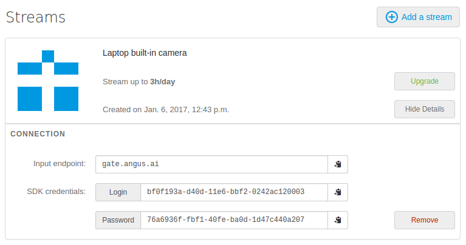

Python SDK
++++++++++

You must have registered `here <https://console.angus.ai/register>`__ to generate your API credentials.

The SDK is Python3 compatible but the documentation code snippets are only Python2 compatible.

You might want to create a python virtual environnement with **virtualenv** in order to install the sdk in there. Please refer to the following `virtualenv guide <http://docs.python-guide.org/en/latest/dev/virtualenvs/>`_ for more information.

1. Install the SDK
==================

Open a terminal and install the angus python sdk with pip. If you do not use **virtualenv** you may need to be root, administrator or super user depending on your platform (use sudo on linux platform).

.. parsed-literal::

        $ pip install angus-sdk-python

2. Configure your SDK
=====================

You must configure your sdk with the keys you received by creating a stream `here <https://console.angus.ai/>`__.
These keys are used to authenticate the requests you are about to send.

Your API credentials can be retrieved by clicking on "Show details" on your console interface as shown below:

In a terminal, type:

.. parsed-literal::

   $ angusme
   Please choose your gateway (current: https://gate.angus.ai):
   Please copy/paste your client_id: xxxxxxxx-xxxx-xxxx-xxxx-xxxxxxxxxxxx
   Please copy/paste your access_token: xxxxxxxx-xxxx-xxxx-xxxx-xxxxxxxxxxxx

Fill in the "client_id" prompt with the "login" given on the interface and
the "access_token" prompt with the "password" given on the interface.

On **Windows** system, if angusme does not work, please refer to the :ref:`faq` for more details.

You can check this setup went well by typing the following command and checking that our server sees you:

.. parsed-literal::

   $ angusme -t
   Server: https://gate.angus.ai
   Status: OK

If this command gives you an error, check that you enter the right "client_id" and "acccess_token".
You can do this by re-typing "angusme" in a command prompt.

If you need help, contact us here : contact@angus.ai !

3. Access your sensor stream
============================

Angus.ai API is specifically designed to process a video stream. This section will show you a way to access the stream of a webcam plugged to your computer by using OpenCV2.

Note that the following code sample can be adapted to process a video file instead.

Note also that OpenCV2 is not an absolute pre-requisite, the following code sample can easily be adapted to be used with any other way of retrieving successive frames from a video stream. If you need assistance, please contact us at contact@angus.ai

*Prerequisite*

- you have a working webcam plugged into your PC
- you have installed **OpenCV2** and **OpenCV2** python bindings. Please refer to `OpenCV documentation <http://opencv.org/>`_ to proceed, or check :ref:`faq` chapter.

On Debian-like platform, **OpenCV2** comes pre-installed, you just need to run

.. parsed-literal::

   $ sudo apt-get install python-opencv

Then copy this code snippet in a file and run it.

.. literalinclude:: stream_fromwebcam.py

.. parsed-literal::

  $ python yourcopiedfile.py

Check that your web cam video stream is correctly displayed on your screen.

