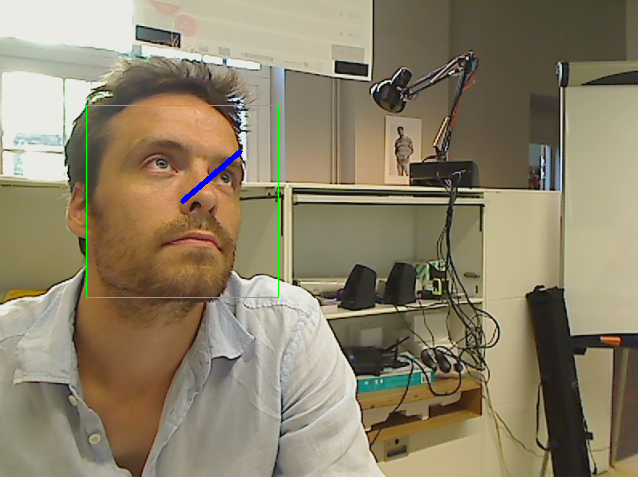

Gaze Analysis
=============

What are people in front of my object looking at?

Getting Started
---------------

Using the Python SDK:

.. literalinclude:: gazeanalysis.py

Input
-----

The API takes a stream of 2d still images as input, of format ``jpg`` or ``png``, without constraints on resolution.

Note however that the bigger the resolution, the longer the API will take to process and give a result.

The function ``process()`` takes a dictionary as input formatted as follows:

.. code-block:: javascript

    {'image' : file}

* ``image``: a python ``File Object`` as returned for example by ``open()`` or a ``StringIO`` buffer.

Output
------

Events will be pushed to your client following that format:

.. code-block:: javascript

    {
      "input_size" : [480, 640],
      "nb_faces" : 1,
      "faces" : [
                  {
                    "roi" : [250, 142, 232, 232],
                    "roi_confidence" : 0.89,
                    "eye_left" : [123, 253],
                    "eye_right" : [345, 253],
                    "nose" : [200, 320],
                    "head_yaw" : 0.03,
                    "head_pitch"   : 0.23,
                    "head_roll"  : 0.14,
                    "gaze_yaw"    : 0.05,
                    "gaze_pitch"  : 0.12
                  }
                ]
    }

* ``input_size`` : width and height of the input image in pixels (to be used as reference to ``roi`` output.
* ``nb_faces`` : number of faces detected in the given image
* ``roi`` : contains ``[pt.x, pt.y, width, height]`` where pt is the upper left point of the rectangle outlining the detected face.
* ``roi_confidence`` : an estimate of the probability that a real face is indeed located at the given ``roi``.
* ``head_yaw``, ``head_pitch``, ``head_roll`` : head pose orientation in radian.
* ``gaze_yaw``, ``gaze_pitch`` : gaze (eyes) orientation in radian.
* ``eye_left``, ``eye_right``, ``nose`` : the coordinate of the eyes and noze in the given image.

Code Sample
-----------

**requirements**: opencv2, opencv2 python bindings

This code sample retrieves the stream of a web cam and display in a GUI the result of the ``face_detection`` service.

.. literalinclude:: gazeanalysis_fromwebcam.py

