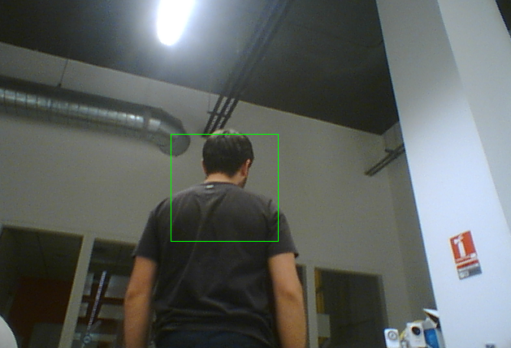

Upper Body Detection
====================

Do I see a human? How many? Where?
As opposed to the Face Detection service, this service is able to detect a human even if his/her face is not visible.

Getting Started
---------------

Using Angus python SDK:

.. literalinclude:: upperbodydetection.py

Input
-----

The API takes a stream of 2d still images as input, of format ``jpg`` or ``png``, without constraints on resolution.

Note however that the bigger the resolution, the longer the API will take to process and give a result.

The function ``process()`` takes a dictionary as input formatted as follows:

.. code-block:: javascript

    {'image' : file}

* ``image``: a python ``File Object`` as returned for example by ``open()`` or a ``StringIO`` buffer.

Output
------

Events will be pushed to your client following that format:

.. code-block:: javascript

    {
      "input_size" : [480, 640],
      "nb_upper_bodies" : 2,
      "upper_bodies" : [
                  {
                    "upper_body_roi" : [345, 223, 34, 54],
                    "upper_body_roi_confidence" : 0.89
                  },
                  {
                    "upper_body_roi" : [35, 323, 45, 34],
                    "upper_body_roi_confidence" : 0.56
                  }
                ]
    }

* ``input_size`` : width and height of the input image in pixels (to be used as reference to ``roi`` output.
* ``nb_upper_bodies`` : number of upper bodies detected in the given image
* ``upper_body_roi`` : contains ``[pt.x, pt.y, width, height]`` where pt is the upper left point of the rectangle outlining the detected upper body.
* ``upper_body_roi_confidence`` : an estimate of the probability that a real human upper body is indeed located at the given ``upper_body_roi``.

Code Sample
-----------

**requirements**: opencv2, opencv2 python bindings

This code sample retrieves the stream of a web cam and display in a GUI the result of the ``upper_body_detection`` service.

.. literalinclude:: upperbodydetection_fromwebcam.py

